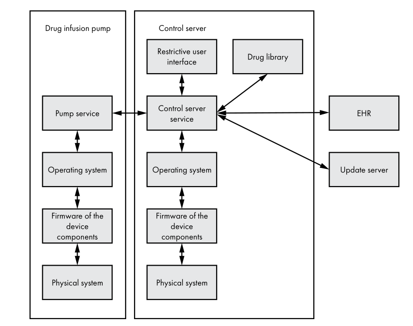
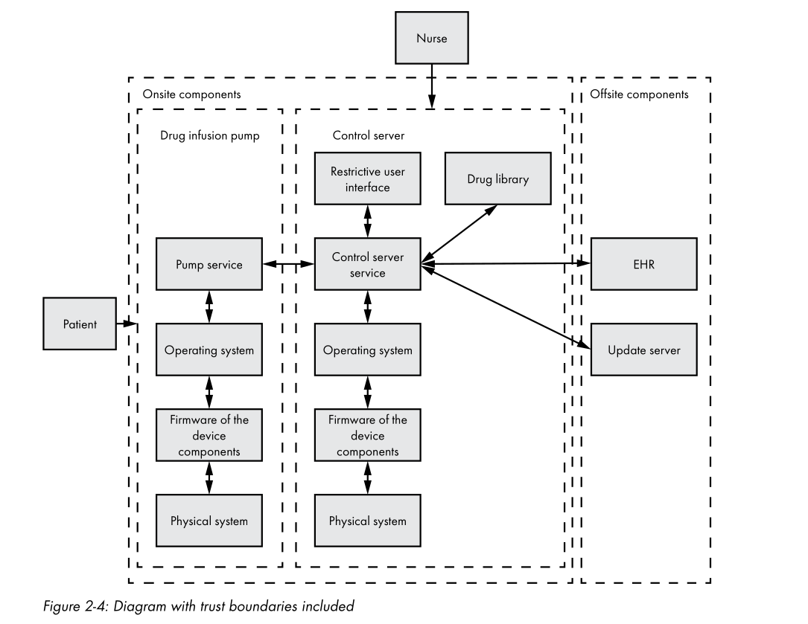
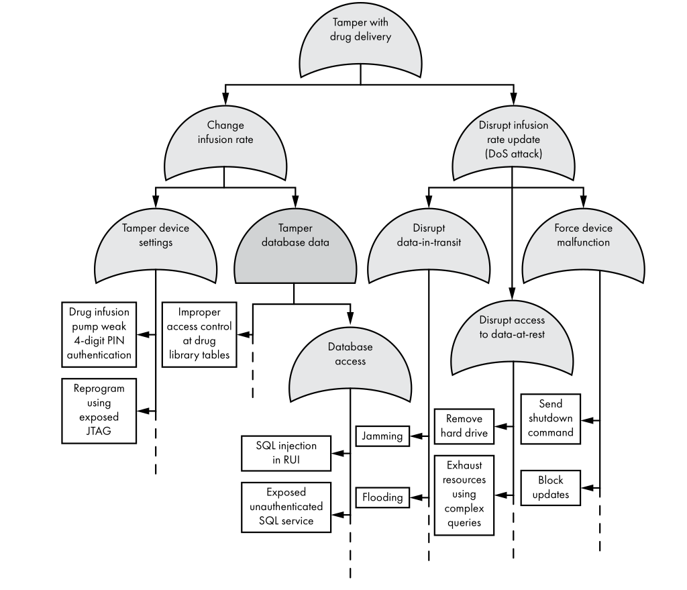

# Threat Modeling

Threat modeling **systematically identifies possible attacks** against a system and prioritises them by severity. It is the foundation of any security assessment — without it you are guessing at what to test.

---

## What Threat Modeling Gives You

```
  System under review
         |
         v
  +-------------------------------+
  | Threat Modeling               |
  |  1. Map the architecture      |
  |  2. Break into components     |
  |  3. Identify threats per part |
  |  4. Rate and prioritise       |
  +-------------------------------+
         |
         v
  Ranked list of threats + mitigations
  ready for a security assessment
```

---

## The STRIDE Framework

STRIDE is a **software-centric** threat classification model developed at Microsoft. It focuses on weaknesses in technology components rather than on assets or attackers.

```
  S -- Spoofing          Actor pretends to be a system component
  T -- Tampering         Actor violates the integrity of data or a system
  R -- Repudiation       Users can deny they performed certain actions
  I -- Information       Actor violates confidentiality of system data
       Disclosure
  D -- Denial of Service Actor disrupts availability of a component
  E -- Elevation of      Actor gains privilege level they should not have
       Privilege
```

STRIDE has three steps:

```
  Step 1          Step 2                    Step 3
  +----------+    +--------------------+    +--------------------+
  | Identify |    | Break into         |    | Apply STRIDE to    |
  | the      |--->| components, map    |--->| each component.    |
  | architecture   data flows and      |    | List one or more   |
  |          |    | trust boundaries   |    | threats per letter |
  +----------+    +--------------------+    +--------------------+
```

---

## Threat Scenarios

STRIDE gives you **categories** — broad labels for the *type* of threat. A **threat scenario** makes that concrete and narrative. It is the primary deliverable of a STRIDE analysis and the unit you score, test, and mitigate.

A good threat scenario answers five questions:

```
  WHO         the attacker or actor
  DOES WHAT   the specific action taken
  TO WHAT     the target component or data
  HOW         the technique or weakness exploited
  IMPACT      the consequence if it succeeds
```

### Abstract category vs concrete scenario

```
  STRIDE category (abstract):
  +-----------------------------------------+
  | Tampering — actor violates integrity    |
  | of data or a system                     |
  +-----------------------------------------+

  Threat scenario (concrete):
  +-----------------------------------------+
  | WHO:    Attacker on hospital Wi-Fi      |
  | WHAT:   Intercepts and modifies packet  |
  | TARGET: Pump command channel (TCP)      |
  | HOW:    MITM on unencrypted connection  |
  | IMPACT: Infusion rate changed from      |
  |         5 ml/hr to 50 ml/hr —          |
  |         patient overdose risk           |
  +-----------------------------------------+
```

### Where threat scenarios sit in the full workflow

```
  STRIDE category                            Threat scenario
  identified on component                    written from category
  +---------------------------+    +------->+------------------------------+
  | Tampering                 |    |        | Attacker MITMs Wi-Fi and     |
  | on pump comm. channel     +----+        | alters dose command          |
  +---------------------------+             +---------------+--------------+
                                                            |
                                    +----------+  +---------+----------+  +------------------+
                                    | DREAD    |  | Attack tree        |  | Mitigation /     |
                                    | scoring  |  | leaf node          |  | security req     |
                                    +----------+  +--------------------+  +------------------+
```

### Threat scenario template

Use this structure to write a scenario for every STRIDE cell you identify:

```
  Scenario ID:   [e.g. T-PUMP-01]
  Component:     [target component]
  STRIDE cat:    [S / T / R / I / D / E]
  Scenario:      [One sentence: who does what to what using how]
  Preconditions: [What must be true for the attack to work]
  Impact:        [What happens if it succeeds]
  DREAD score:   [D=x R=x E=x A=x D=x  avg=x]
  Mitigation:    [Specific control to prevent or detect it]
```

### Worked scenario examples from the pump system

```
  +--------+-----------------+-------+----------------------------------+
  | ID     | Component       | STRIDE| Scenario                         |
  +--------+-----------------+-------+----------------------------------+
  | T-R-01 | RUI             | S     | Attacker guesses a nurse's 4-    |
  |        |                 |       | digit PIN (10,000 combinations)  |
  |        |                 |       | and issues pump commands as that |
  |        |                 |       | nurse, bypassing accountability  |
  +--------+-----------------+-------+----------------------------------+
  | T-R-02 | RUI             | T     | Attacker plugs in USB keyboard   |
  |        |                 |       | and presses ALT+F4 to close the  |
  |        |                 |       | kiosk, reaching the full Windows |
  |        |                 |       | desktop with nurse privileges    |
  +--------+-----------------+-------+----------------------------------+
  | T-C-01 | Control Server  | T     | Attacker on hospital Wi-Fi runs  |
  |        | Service         |       | ARP spoofing to MITM the pump    |
  |        |                 |       | TCP connection and substitutes   |
  |        |                 |       | falsified sensor readings,       |
  |        |                 |       | masking a pump malfunction       |
  +--------+-----------------+-------+----------------------------------+
  | T-C-02 | Control Server  | I     | Control server includes full     |
  |        | Service         |       | patient record in the software   |
  |        |                 |       | update request body sent to the  |
  |        |                 |       | offsite vendor update server     |
  +--------+-----------------+-------+----------------------------------+
  | T-D-01 | Drug Library    | T     | Attacker exploits unsanitised    |
  |        |                 |       | drug name field in RUI to inject |
  |        |                 |       | SQL that raises a drug's maximum |
  |        |                 |       | dose limit in the database       |
  +--------+-----------------+-------+----------------------------------+
  | T-P-01 | Pump Service    | D     | Attacker reverse-engineers the   |
  |        |                 |       | custom TCP protocol, identifies  |
  |        |                 |       | the STOP_PUMP command byte       |
  |        |                 |       | sequence, and replays it over    |
  |        |                 |       | Wi-Fi to halt all active pumps   |
  +--------+-----------------+-------+----------------------------------+
  | T-F-01 | Firmware        | T     | Attacker connects JTAG probe to  |
  |        |                 |       | exposed header on pump PCB and   |
  |        |                 |       | flashes modified firmware that   |
  |        |                 |       | ignores dose-limit safety checks |
  +--------+-----------------+-------+----------------------------------+
```

### Key properties of a good threat scenario

```
  +-------------------------+--------------------------------------------+
  | Property                | Why it matters                             |
  +-------------------------+--------------------------------------------+
  | Specific, not vague     | "ARP spoof on Wi-Fi" not "network attack"  |
  | Tied to one component   | Keeps DREAD scoring accurate               |
  | One STRIDE category     | Avoids double-counting                     |
  | Realistic preconditions | Filters out theoretical non-issues         |
  | Measurable impact       | Enables prioritisation and sign-off        |
  | Actionable mitigation   | Each scenario should yield a security req  |
  +-------------------------+--------------------------------------------+
```

---

## Worked Example — Drug Infusion Pump

The following walks through a full STRIDE threat model for a hospital drug infusion pump connected to a control server over Wi-Fi.

---

## How the Drug Infusion Pump System Works



A drug infusion pump delivers controlled doses of medication directly into a patient's bloodstream. In a hospital setting it does not operate in isolation — it is part of a networked ecosystem managed by clinical staff.

```
  High-level operational flow:

  [Nurse logs in]
       |
       v
  [RUI on Control Server]        "Select patient, drug, dose rate"
       |
       v
  [Control Server Service]       Validates against drug library,
       |                         fetches patient record from EHR,
       |                         sends dosage command to pump
       v
  [Drug Infusion Pump]           Microcontroller executes infusion
       |                         at the specified rate
       v
  [Patient receives medication]

  Periodic status feedback flows back up:
  [Pump] --status/readings--> [Control Server] --alerts--> [Nurse]
```

### Physical operation of the pump

```
  Inside the pump:
  +-----------------------------------------------------+
  |                Drug Infusion Pump                   |
  |                                                     |
  |  [Drug reservoir / IV bag]                          |
  |         |                                           |
  |         v                                           |
  |  [Peristaltic motor / syringe driver]  <-- rate set |
  |         |                              by software  |
  |         v                                           |
  |  [Flow sensor]  -- measures actual rate delivered   |
  |         |                                           |
  |         v                                           |
  |  [Microcontroller]  <-- receives commands from      |
  |         |              Pump Service software        |
  |         v                                           |
  |  [Wi-Fi / network interface]                        |
  |         |                                           |
  |  [Physical casing, buttons, alarm speaker]          |
  +-----------------------------------------------------+
         |
         | Wi-Fi (insecure flat hospital network)
         v
  [Control Server]
```

---

## What Each Component Does

```
  +----------------------+-----------------------------------------------+
  | Component            | Role                                          |
  +----------------------+-----------------------------------------------+
  | Drug Infusion Pump   | The physical device delivering medication.    |
  | (hardware)           | Contains motor, sensors, battery backup, and  |
  |                      | a network interface. Executes infusion rate   |
  |                      | commands received from the control server.    |
  +----------------------+-----------------------------------------------+
  | Pump Service         | Software running on the pump. Acts as the     |
  |                      | bridge between the control server and the     |
  |                      | microcontroller. Receives commands, validates |
  |                      | them, and drives the hardware. Sends readings |
  |                      | (flow rate, alarm state) back to the server.  |
  +----------------------+-----------------------------------------------+
  | Control Server       | The central computer nurses interact with.    |
  |                      | Aggregates data from all pumps in the ward,   |
  |                      | runs the drug library database, and provides  |
  |                      | the UI for clinical staff.                    |
  +----------------------+-----------------------------------------------+
  | Control Server       | The main application on the control server.   |
  | Service              | Manages communication with all pumps (via     |
  |                      | custom TCP protocol), with the RUI, with the  |
  |                      | drug library, and with external systems       |
  |                      | (EHR via HTTPS, update server via TCP).       |
  +----------------------+-----------------------------------------------+
  | Restrictive User     | A kiosk application — like an ATM screen —   |
  | Interface (RUI)      | running on the control server. Limits nurses  |
  |                      | to a small set of permitted actions: select   |
  |                      | patient, select drug, set rate, view alerts.  |
  |                      | Cannot be exited under normal operation.      |
  +----------------------+-----------------------------------------------+
  | Drug Library         | A database holding all drug profiles: dosage  |
  |                      | limits, concentrations, interaction warnings, |
  |                      | and infusion rate ranges. Also manages user   |
  |                      | accounts for clinical staff.                  |
  +----------------------+-----------------------------------------------+
  | Operating System     | Runs on both the pump and the control server. |
  |                      | Provides process isolation, filesystem access,|
  |                      | networking, and hardware abstraction. Often   |
  |                      | Android or a Linux distribution on the server;|
  |                      | RTOS on the pump microcontroller.             |
  +----------------------+-----------------------------------------------+
  | Firmware             | Low-level software burned into each hardware  |
  |                      | component (NIC, display, motor controller).   |
  |                      | Initialises hardware before the OS boots.     |
  |                      | Vendor-signed; device should verify signature.|
  +----------------------+-----------------------------------------------+
  | Physical System      | The hardware chassis, circuit boards, ports,  |
  |                      | power supply, and physical interfaces (USB,   |
  |                      | JTAG, Ethernet). The root of hardware trust.  |
  +----------------------+-----------------------------------------------+
  | EHR                  | Electronic Health Record system — offsite     |
  | (External)           | database holding patient medical histories.   |
  |                      | Control server queries it for patient data    |
  |                      | before configuring a drug infusion session.   |
  +----------------------+-----------------------------------------------+
  | Update Server        | Third-party vendor server that delivers       |
  | (External)           | software and drug library updates to the      |
  |                      | control server. Outside the hospital's trust  |
  |                      | boundary.                                     |
  +----------------------+-----------------------------------------------+
```

---

### Step 1 — Identify the Architecture

Start with the highest-level view of the system.

```
  +--------------------+          +------------------+
  |  Drug infusion     |<-------->|  Control server  |
  |  pump              |          |                  |
  +--------------------+          +------------------+
```

The control server also connects to external systems for patient records and software updates:

```
  +--------------------+          +------------------+     +--------+
  |  Drug infusion     |<-------->|  Control server  |<--->|  EHR   |
  |  pump              |          |                  |     +--------+
  +--------------------+          +------------------+
                                          ^
                                          |           +----------------+
                                          +---------->|  Update server |
                                                      +----------------+

  EHR = Electronic Health Record
  All communication flows bidirectionally.
  Network is insecure (flat hospital Wi-Fi, no segmentation).
```

### Step 2 — Break into Components

Zoom in to show the internal layers of each device.


Data flows **bidirectionally** between all components. Any crossing of a data flow between components is a potential attack entry point.

---

## Data Flows Between Components

Understanding exactly what data moves where is critical — it reveals where sensitive information is exposed and which paths an attacker can exploit.
| Category            | Key Questions                                                                 |
|---------------------|-------------------------------------------------------------------------------|
| Components          | Who sends/receives the data? Any intermediaries (gateways, drivers, daemons)? |
| Direction           | One-way? Bidirectional? Request/response? Who initiates?                      |
| Protocol            | TCP/UDP/BLE/CAN/HTTP/MQTT? JSON/XML/custom? Security features available?      |
| Data Content        | What data is sent? Sensitive? Commands, telemetry, IDs, credentials?          |
| Trust Boundaries    | Does data cross devices, networks, ECUs, OS layers? Different trust zones?    |
| Security Controls   | Encryption? Authentication? Integrity? Nonce/sequence for anti‑replay?        |
| Triggers            | Event-driven? Periodic? User-triggered? Remote command?                       |
| Data Handling       | Stored? Parsed? Logged? Forwarded? Used in safety/logic decisions?            |
| Assumptions         | What assumptions exist about validity, freshness, sender identity, order?     |
| Attacker Actions    | Can attacker sniff, tamper, spoof, replay, inject, jam, DoS, impersonate?     |

```
                [NURSE]
                   │
                   │ ① PIN · patient selection · drug · rate config · alarm ack
                   ▼
╔══════════════════════════════ HOSPITAL (ONSITE) ═══════════════════════════════╗
║                                                                                ║
║  ┌──────────────────────────────────────────────────────────────────────────┐ ║
║  │                               RUI                                        │ ║
║  └──────────────────────────────────┬───────────────────────────────────────┘ ║
║                                     │ ② commands · drug queries               ║
║                                     ▼                                          ║
║  ┌──────────────────────────────────────────┐  ③ dose queries  ┌───────────┐ ║
║  │           Control Server Svc             │ ───────────────► │   Drug    │ ║
║  │                                          │ ◄─── params ───  │  Library  │ ║
║  └────────────────────┬─────────────────────┘    credentials   └───────────┘ ║
║                       │                                                        ║
║            ┌────── ④ Wi-Fi ⚠️  [UNENCRYPTED] ──────┐                        ║
║            │  ──► infusion cmds · rate (ml/hr) · OTA │                        ║
║            │  ◄── sensor readings · alarms · status   │                        ║
║            └──────────────────┬──────────────────────┘                        ║
║                               ▼                                                ║
║  ┌──────────────────────────────────────────────────────────────────────────┐ ║
║  │                            DRUG PUMP                                     │ ║
║  └──────────────────────────────────────────────────────────────────────────┘ ║
║                               ▲                                                ║
║                               │ [PATIENT] — physical contact                   ║
╚══════════════════╤════════════════════════════════════════╤════════════════════╝
                   │                                        │
      ⑤ HTTPS ✓   │                        ⑥ Custom TCP ⚠️ │
  ──► patient ID   │                         ──► serial · FW version
  ──► session logs │                         ──► drug lib version
  ◄── PHI          │                         ◄── firmware packages
  ◄── allergies    │                         ◄── drug lib updates
  ◄── orders       │                         ⚠️  may also carry PHI
                   ▼                                        ▼
            ┌─────────────┐                      ┌──────────────────┐
            │     EHR     │                      │  UPDATE SERVER   │
            │  (OFFSITE)  │                      │    (OFFSITE)     │
            └─────────────┘                      └──────────────────┘
```

**Complete data flow map**

```
  COMPLETE DATA FLOW MAP

  Actor/Component          Data Sent                     Direction
  +--------------------+  +---------------------------+  +----------+
  | Nurse              |  | Login PIN, drug selection,|  --> RUI    |
  |                    |  | patient ID, dose rate     |             |
  +--------------------+  +---------------------------+             |
                                                                     |
  +--------------------+  +---------------------------+             |
  | RUI                |  | User commands (validated) |  --> Control|
  |                    |  | Login events              |  server svc |
  +--------------------+  +---------------------------+             |
                          | UI state, alerts, errors  |  <-- Control|
                          |                           |  server svc |
  +--------------------+  +---------------------------+             |
  | Control Server Svc |  | Patient identity query    |  --> EHR   |
  |                    |  | Drug/dose validation req  |             |
  |                    |  +---------------------------+             |
  |                    |  | Patient health record     |  <-- EHR   |
  |                    |  +---------------------------+             |
  |                    |  | Software update request   |  --> Update |
  |                    |  | Drug library update req   |  server     |
  |                    |  +---------------------------+             |
  |                    |  | Firmware / software pkg   |  <-- Update |
  |                    |  | Drug library data         |  server     |
  |                    |  +---------------------------+             |
  |                    |  | Dosage command, config    |  --> Pump  |
  |                    |  | Drug settings             |  service    |
  |                    |  +---------------------------+             |
  |                    |  | Flow readings, alarm state|  <-- Pump  |
  |                    |  | Status telemetry          |  service    |
  +--------------------+  +---------------------------+             |
                                                                     |
  +--------------------+  +---------------------------+             |
  | Drug Library       |  | Drug profiles, dose limits|  <-> Control|
  | (Database)         |  | User account data         |  server svc |
  +--------------------+  +---------------------------+             |
                                                                     |
  +--------------------+  +---------------------------+             |
  | Pump Service       |  | Motor commands (rate, stop|  --> Micro- |
  |                    |  | alarm trigger)            |  controller |
  |                    |  +---------------------------+             |
  |                    |  | Sensor readings (flow,    |  <-- Micro- |
  |                    |  | pressure, occlusion)      |  controller |
  +--------------------+  +---------------------------+             |
```

### Sensitive data crossing trust boundaries

These are the highest-risk data flows — each one is a potential threat entry point.

```
  BOUNDARY CROSSING                 DATA                    RISK
  +--------------------------------+------------------------+-----------+
  | Pump <--> Control server       | Dosage commands        | CRITICAL  |
  | (insecure Wi-Fi)               | Patient identity       | Unencrypted|
  |                                | Sensor readings        | MITM risk |
  +--------------------------------+------------------------+-----------+
  | Control server <--> EHR        | Full patient records   | HIGH      |
  | (HTTPS, but data scope wide)   | Medical history        | Over-share|
  +--------------------------------+------------------------+-----------+
  | Control server <--> Update srv | Software packages      | HIGH      |
  | (custom TCP, offsite vendor)   | Patient data leakage   | Supply    |
  |                                |                        | chain risk|
  +--------------------------------+------------------------+-----------+
  | Nurse --> RUI                  | 4-digit PIN            | MEDIUM    |
  | (physical kiosk)               | Patient selection      | Weak auth |
  +--------------------------------+------------------------+-----------+
  | Patient --> Pump               | Physical contact only  | MEDIUM    |
  | (physical proximity)           | Can tamper with device | Physical  |
  +--------------------------------+------------------------+-----------+
```

---

## Asset Identification

An asset is anything of value that must be protected and what threat actors want.
Identifying assets before threat analysis ensures you know **what you are defending** and can assess the real-world impact of each threat.

Questions to perform  Asset Identification:
| Category              | Key Questions                                                                                  |
|-----------------------|------------------------------------------------------------------------------------------------|
| Asset Type            | Is the asset hardware, software, data, interface, credential, or physical resource?           |
| Asset Owner           | Who owns, maintains, or is responsible for this asset?                                         |
| Asset Location        | Where is the asset stored, executed, or physically located?                                    |
| Asset Value           | Why is this asset important? Safety? Privacy? Financial? Operational?                          |
| Asset Function        | What role does the asset play in the system (control, monitoring, communication, logging)?     |
| Asset Users           | Who interacts with the asset (humans, ECUs, cloud services, apps)?                            |
| Accessibility         | Who can access this asset and through what interfaces?                                         |
| Interfaces/Inputs     | What interfaces expose this asset (API, CLI, BLE, Wi‑Fi, UART, CAN, USB)?                     |
| Data Sensitivity      | Does the asset contain sensitive data (keys, credentials, patient info, vehicle status)?        |
| Dependencies          | Which components does this asset depend on?                                                    |
| Exposure              | Is the asset internal-only, network-exposed, cloud-exposed, or physically exposed?            |
| Failure Impact        | If compromised, what impact occurs (safety, privacy, DoS, incorrect operation)?                |
| Threat Attractiveness | Why would an attacker target this asset (keys, control authority, sensitive data)?             |
| Trust Level           | In which trust zone does the asset reside? Low/medium/high?                                    |
| Required Protections  | Does the asset require confidentiality, integrity, availability, authenticity, non-repudiation?|
### Asset Categories

```
  +---------------------+----------------------------------------------+
  | Asset Category      | Examples in the pump system                  |
  +---------------------+----------------------------------------------+
  | Data assets         | Patient health records, infusion history,    |
  |                     | drug dosage settings, authentication creds,  |
  |                     | encryption keys, audit logs                  |
  +---------------------+----------------------------------------------+
  | Software assets     | Pump firmware, control server service,       |
  |                     | drug library data, OS configuration,         |
  |                     | software update packages                     |
  +---------------------+----------------------------------------------+
  | Hardware assets     | Pump chassis, circuit boards, microcontroller|
  |                     | control server hardware, network interfaces  |
  +---------------------+----------------------------------------------+
  | Operational assets  | Drug infusion session continuity (patient    |
  |                     | safety), clinical staff access availability, |
  |                     | regulatory compliance (CE, HIPAA)            |
  +---------------------+----------------------------------------------+
```

| # | Asset | Where It Lives | Why It Matters |
|---|---|---|---|
| 1 | **Patient Safety** | Drug Pump (bedside) | Wrong dose rate = patient death |
| 2 | **Patient Health Data** | EHR · Control Server · Pump logs | PHI under HIPAA; legal & financial liability |
| 3 | **Auth Credentials** | RUI · Control Server · Vendor infra | PIN, API keys, vendor remote access |
| 4 | **Drug Library** | Control Server (onsite DB) | Defines what "safe dose" means to the pump |
| 5 | **Firmware Integrity** | Pump · Control Server hardware | Persists through OS reinstall & disk replacement |
| 6 | **System Availability** | Pump · Control Server · Wi-Fi link | Pump downtime = medical emergency |


### Asset Location Map

```
 ONSITE                                      OFFSITE
 ┌─────────────────────────────────────┐     ┌──────────────────┐
 │                                     │     │                  │
 │  ┌─────────────┐                    │     │  ┌───────────┐   │
 │  │ DRUG PUMP   │                    │     │  │   EHR     │   │
 │  │             │                    │     │  │           │   │
 │  │ [A1] Safety │◄──────────────┐    │     │  │ [A2] PHI  │   │
 │  │ [A5] FW     │               │    │     │  └───────────┘   │
 │  │ [A6] Avail  │               │    │     │                  │
 │  └─────────────┘               │    │     │  ┌───────────┐   │
 │                                │    │     │  │  UPDATE   │   │
 │  ┌─────────────────────────┐   │    │     │  │  SERVER   │   │
 │  │    CONTROL SERVER       │   │    │     │  │           │   │
 │  │                         │───┘    │     │  │ [A3] Cred │   │
 │  │  RUI  → [A3] Credentials│        │     │  └───────────┘   │
 │  │  CSS  → [A6] Avail      │        │     │                  │
 │  │  DB   → [A4] Drug Lib   │        │     └──────────────────┘
 │  │         [A2] PHI        │        │
 │  │  FW   → [A5] Integrity  │        │
 │  └─────────────────────────┘        │
 │                                     │
 └─────────────────────────────────────┘

 Asset Key:
 [A1] Patient Safety    [A2] Patient Health Data   [A3] Auth Credentials
 [A4] Drug Library      [A5] Firmware Integrity    [A6] System Availability
```


### Asset Inventory Table

For each asset, record its **security attributes** — which properties matter most.

```
  C = Confidentiality   I = Integrity   A = Availability
  (must stay secret)    (must be accurate) (must be reachable)

  +-------------------------------+---+---+---+---------------------------+
  | Asset                         | C | I | A | Impact if compromised     |
  +-------------------------------+---+---+---+---------------------------+
  | Patient health records        | X | X |   | Privacy breach, HIPAA     |
  |                               |   |   |   | violation, liability       |
  +-------------------------------+---+---+---+---------------------------+
  | Drug dosage commands          |   | X | X | Wrong dose delivered,     |
  |                               |   |   |   | patient injury or death   |
  +-------------------------------+---+---+---+---------------------------+
  | Nurse authentication (PIN)    | X | X |   | Unauthorised pump access, |
  |                               |   |   |   | impersonation             |
  +-------------------------------+---+---+---+---------------------------+
  | Drug library data             |   | X | X | Incorrect dosage limits,  |
  |                               |   |   |   | wrong drug administered   |
  +-------------------------------+---+---+---+---------------------------+
  | Audit / access logs           |   | X | X | Cannot detect intrusion,  |
  |                               |   |   |   | non-repudiation fails     |
  +-------------------------------+---+---+---+---------------------------+
  | Pump firmware                 |   | X | X | Persistent malware,       |
  |                               |   |   |   | survives OS reinstall     |
  +-------------------------------+---+---+---+---------------------------+
  | Software update packages      | X | X |   | Supply chain attack,      |
  |                               |   |   |   | trojanised update pushed  |
  +-------------------------------+---+---+---+---------------------------+
  | Infusion session continuity   |   |   | X | Pump stops mid-session,   |
  |                               |   |   |   | patient misses critical   |
  |                               |   |   |   | medication dose           |
  +-------------------------------+---+---+---+---------------------------+
  | Encryption / signing keys     | X | X |   | All encrypted traffic     |
  |                               |   |   |   | exposed; firmware spoofed |
  +-------------------------------+---+---+---+---------------------------+
  | Control server hardware       |   | X | X | All connected pumps lose  |
  |                               |   |   |   | management; full ward     |
  |                               |   |   |   | outage                    |
  +-------------------------------+---+---+---+---------------------------+
```

### Mapping Assets to Threats

Each asset maps directly to the threats that target it. This is the bridge between asset identification and STRIDE analysis.

```
  Asset: Drug dosage command
    |
    +--[Integrity]--> Tampering      (MITM changes the dose value)
    +--[Integrity]--> Spoofing       (fake pump sends false readings)
    +--[Availability]-> DoS          (attacker sends shutdown command)

  Asset: Patient health records
    |
    +--[Confidentiality]--> Info Disclosure  (unencrypted Wi-Fi channel)
    +--[Confidentiality]--> Info Disclosure  (data leaked to update server)
    +--[Integrity]-------> Tampering         (world-writeable log files)

  Asset: Nurse PIN / authentication
    |
    +--[Confidentiality]--> Spoofing         (PIN guessed / brute-forced)
    +--[Integrity]-------> Repudiation       (shared account, no traceability)
    +--[Availability]----> DoS               (lockout blocks emergency access)

  Asset: Firmware
    |
    +--[Integrity]-------> Tampering         (malware installed via JTAG)
    +--[Integrity]-------> Spoofing          (downgrade to vulnerable version)
    +--[Availability]----> DoS               (OTA update blocked)
```

---

### Step 3 — Add Trust Boundaries

Trust boundaries group components with the same security attributes. Data crossing a boundary is where threats concentrate.
Trust boundaries are the lines in our diagram where data crosses from one security context to another. At every boundary, ask:

- **Who is authenticating whom?**
- **Who is authorizing the action?**
- **Is the data validated?**
- **Can it be tampered with in transit?**
  


---

### When Trust Assumptions Break — How Attackers Exploit Them

Designers build trust assumptions into every boundary. Attackers look for where those assumptions are **wrong**.

| Trust Assumption Made | Reality | How Attacker Breaks It |
|-----------------------|---------|------------------------|
| "The nurse entering the PIN is a legitimate staff member" | PIN is 4 digits, shared across all staff, no lockout delay | Shoulder-surf or brute-force the PIN; every nurse becomes the same identity |
| "The RUI controls everything a user can do" | RUI is a UI layer — the OS underneath has no awareness of RUI restrictions | Connect a USB keyboard, trigger Alt-F4 or Sticky Keys, escape to OS shell |
| "Commands arriving over Wi-Fi come from the control server" | No cryptographic device certificates; identity is IP/MAC-based | Sit on the same Wi-Fi segment, spoof the control server's MAC/IP, send commands directly to the pump |
| "The pump readings arriving at the control server are real" | Same unencrypted Wi-Fi channel, no message authentication | MITM the Wi-Fi — intercept sensor readings, substitute falsified values, forward to control server |
| "The update server is a trusted vendor system" | Internet-facing, custom protocol, unclear authentication | Compromise the update server, inject malicious firmware — every hospital pulling updates gets the payload |
| "Patient data stays onsite" | Update channel carries more than version strings | Passively monitor the Custom TCP stream; PHI exits the hospital with no TLS, no audit trail |

#### The Pattern
- **Designers assume** the environment enforces the boundary (network isolation, UI restriction, trusted vendor)
- **Attackers assume** nothing is enforced unless proven cryptographically
- Every boundary in this system relies on at least one environmental assumption that the flat, unsegmented hospital network actively violates

## Threat Summary — All Components at a Glance

Before diving per-component, here is every threat in the system mapped to the component it targets and the STRIDE category it falls under.

```
  Component            S  T  R  I  D  E   Key threat
  +--------------------+--+--+--+--+--+--+---------------------------------+
  | RUI                |X |X |X |X |X |X | Weak PIN, kiosk escape, lockout |
  | Control Server Svc |X |X |X |X |X |X | Pump spoofing, MITM, world-     |
  |                    |  |  |  |  |  |  | writeable logs                  |
  | Drug Library       |X |X |X |X |X |X | SQL injection, stored proc exfil|
  | Operating System   |X |X |X |X |X |X | Custom OS boot, firewall bypass |
  | Firmware           |X |X |  |X |X |X | Downgrade, APT persistence      |
  | Physical Equipment |X |X |  |X |X |X | Supply chain, JTAG, side-channel|
  | Pump Service       |X |X |X |X |X |X | No server auth, shutdown cmd    |
  +--------------------+--+--+--+--+--+--+---------------------------------+

  S=Spoofing  T=Tampering  R=Repudiation  I=InfoDisclosure  D=DoS  E=ElevPriv
```

---

## Attack Surface

### Every Entry Point an Attacker Can Touch

#### Network
- [ ] Wi-Fi interface on pump — open to hospital network
- [ ] Wi-Fi interface on control server
- [ ] Custom TCP channel to update server (bidirectional)
- [ ] Management ports: SSH, RDP, web admin

#### Physical
- [ ] USB ports on pump and control server
- [ ] JTAG debug interface on circuit board
- [ ] External storage slots (SD cards)
- [ ] Physical power supply

#### Software
- [ ] RUI — accepts user input, kiosk-escape vectors
- [ ] Control server API — unauthenticated endpoints
- [ ] Drug Library — SQL-accessible via RUI
- [ ] Firmware OTA update mechanism

#### Human
- [ ] Nurse — social engineering, PIN observation
- [ ] Patient — physical pump access
- [ ] IT Admin — elevated internal access
- [ ] Vendor technician — remote support credentials

---

## Identifying Threats — Per Component

A good rule: find **at least one threat per STRIDE letter per component**. Each cell in the tables below is the seed of a **threat scenario** — take the one-line description, add preconditions and impact, and you have a complete, scoreable scenario (see the Threat Scenarios section above).

### Restrictive User Interface (RUI)

The RUI is a kiosk app — like an ATM — that strictly limits what a user can do on the control server.

```
  STRIDE on the RUI:
  +---+--------------------+-----------------------------------------------+
  | S | Spoofing           | Weak 4-digit PIN — attacker guesses PIN and   |
  |   |                    | impersonates a nurse                          |
  +---+--------------------+-----------------------------------------------+
  | T | Tampering          | External keyboard can send hotkeys (ALT+F4)   |
  |   |                    | to escape the kiosk and reach the desktop     |
  +---+--------------------+-----------------------------------------------+
  | R | Repudiation        | Single shared account for all medical staff — |
  |   |                    | logs cannot prove who performed which action  |
  +---+--------------------+-----------------------------------------------+
  | I | Info Disclosure    | Debug/error messages reveal system internals, |
  |   |                    | patient data, or technology stack             |
  +---+--------------------+-----------------------------------------------+
  | D | Denial of Service  | Brute-force lockout after 5 attempts blocks   |
  |   |                    | medical staff from accessing the pump in an   |
  |   |                    | emergency                                     |
  +---+--------------------+-----------------------------------------------+
  | E | Elevation of Priv. | Remote support backdoor (vendor technician    |
  |   |                    | access) uses shared/default credentials       |
  +---+--------------------+-----------------------------------------------+
```

### Control Server Service

The core application managing the pump, RUI, drug library, EHR, and update server.

```
  STRIDE on Control Server Service:
  +---+--------------------+-----------------------------------------------+
  | S | Spoofing           | No solid method to identify pumps — attacker  |
  |   |                    | can mimic a pump and send falsified readings   |
  +---+--------------------+-----------------------------------------------+
  | T | Tampering          | No data integrity check on pump readings;     |
  |   |                    | man-in-the-middle attack feeds false values    |
  +---+--------------------+-----------------------------------------------+
  | R | Repudiation        | World-writeable log files — any local user    |
  |   |                    | can overwrite logs to hide their actions       |
  +---+--------------------+-----------------------------------------------+
  | I | Info Disclosure    | Sends sensitive patient data unnecessarily to  |
  |   |                    | the third-party update server                  |
  +---+--------------------+-----------------------------------------------+
  | D | Denial of Service  | Attacker jams the Wi-Fi signal, severing      |
  |   |                    | communication with all pumps simultaneously   |
  +---+--------------------+-----------------------------------------------+
  | E | Elevation of Priv. | Unauthenticated API endpoints allow high-     |
  |   |                    | privileged actions (e.g. alter pump settings) |
  +---+--------------------+-----------------------------------------------+
```

### Drug Library (Database)

The main database holding all drug information and user management.

```
  STRIDE on Drug Library:
  +---+--------------------+-----------------------------------------------+
  | S | Spoofing           | Weak app-layer access controls allow user      |
  |   |                    | impersonation through the RUI                  |
  +---+--------------------+-----------------------------------------------+
  | T | Tampering          | Unsanitised RUI input enables SQL injection,   |
  |   |                    | allowing data manipulation or code execution   |
  +---+--------------------+-----------------------------------------------+
  | R | Repudiation        | Log entries store user-agent strings from pump |
  |   |                    | in unsafe format — attacker inserts fake log   |
  |   |                    | entries via line-feed characters               |
  +---+--------------------+-----------------------------------------------+
  | I | Info Disclosure    | Stored procedures can perform DNS/HTTP         |
  |   |                    | requests — attacker exfiltrates data via       |
  |   |                    | out-of-band SQL injection to attacker server   |
  +---+--------------------+-----------------------------------------------+
  | D | Denial of Service  | Attacker forces complex queries to exhaust     |
  |   |                    | database resources, halting all operations     |
  +---+--------------------+-----------------------------------------------+
  | E | Elevation of Priv. | Database functions allow code to run as        |
  |   |                    | superuser; user can escalate via RUI actions   |
  +---+--------------------+-----------------------------------------------+
```

### Operating System

Receives input from the control server service — threats derive from that interface.

```
  STRIDE on Operating System:
  +---+--------------------+-----------------------------------------------+
  | S | Spoofing           | Attacker boots custom OS that lacks sandboxing |
  |   |                    | and filesystem permissions                    |
  +---+--------------------+-----------------------------------------------+
  | T | Tampering          | Local/remote access lets attacker disable      |
  |   |                    | firewall, change security settings, add        |
  |   |                    | backdoor executable                            |
  +---+--------------------+-----------------------------------------------+
  | R | Repudiation        | Logs stored locally only; privileged attacker  |
  |   |                    | can delete or alter them                       |
  +---+--------------------+-----------------------------------------------+
  | I | Info Disclosure    | Error/debug messages leak patient data or OS   |
  |   |                    | internals, violating compliance requirements  |
  +---+--------------------+-----------------------------------------------+
  | D | Denial of Service  | Attacker triggers unwanted system restart      |
  |   |                    | (e.g. via malicious update), halting all pumps |
  +---+--------------------+-----------------------------------------------+
  | E | Elevation of Priv. | Misconfigured high-privilege services or apps  |
  |   |                    | allow attacker to reach superuser access       |
  +---+--------------------+-----------------------------------------------+
```

### Device Firmware

Low-level software stored in non-volatile memory of each hardware component (CD/DVD, NIC, display, etc.).

```
  STRIDE on Firmware:
  +---+--------------------+-----------------------------------------------+
  | S | Spoofing           | Logic bug allows downgrade to older firmware   |
  |   |                    | with known CVEs; custom firmware impersonates  |
  |   |                    | the latest vendor release                     |
  +---+--------------------+-----------------------------------------------+
  | T | Tampering          | Malware installed on firmware survives OS      |
  |   |                    | reinstall and disk wipe (APT technique);       |
  |   |                    | BIOS/UEFI config variables can disable         |
  |   |                    | Secure Boot                                    |
  +---+--------------------+-----------------------------------------------+
  | I | Info Disclosure    | Firmware phones home to analytics servers,     |
  |   |                    | leaking patient data; exposes SMRAM contents  |
  +---+--------------------+-----------------------------------------------+
  | D | Denial of Service  | Attacker blocks OTA firmware updates, leaving  |
  |   |                    | device in insecure or unstable state           |
  +---+--------------------+-----------------------------------------------+
  | E | Elevation of Priv. | Vulnerable drivers + undocumented management  |
  |   |                    | interfaces (e.g. SMM) allow privilege escalation|
  |   |                    | Default passwords embedded in firmware        |
  +---+--------------------+-----------------------------------------------+
```

### Physical Equipment

The box containing the processor and the RUI screen.

```
  STRIDE on Physical Equipment:
  +---+--------------------+-----------------------------------------------+
  | S | Spoofing           | Supply chain attack — critical hardware parts  |
  |   |                    | replaced with faulty/malicious components      |
  |   |                    | during manufacturing or shipping               |
  +---+--------------------+-----------------------------------------------+
  | T | Tampering          | USB ports accept untrusted keyboards/drives;   |
  |   |                    | JTAG interface exposes firmware reprogramming  |
  +---+--------------------+-----------------------------------------------+
  | I | Info Disclosure    | Shoulder surfing RUI screen; physical removal  |
  |   |                    | of storage; side-channel attacks (EM, power    |
  |   |                    | analysis) leak keys and passwords             |
  +---+--------------------+-----------------------------------------------+
  | D | Denial of Service  | Power outage shuts down all dependent pumps;  |
  |   |                    | physical circuit manipulation causes hardware  |
  |   |                    | malfunction                                    |
  +---+--------------------+-----------------------------------------------+
  | E | Elevation of Priv. | Race conditions and insecure error handling in |
  |   |                    | embedded CPU allow arbitrary memory read/write |
  +---+--------------------+-----------------------------------------------+
```

### Pump Service

The software on the pump itself — communicates with the control server and the microcontroller.

```
  STRIDE on Pump Service:
  +---+--------------------+-----------------------------------------------+
  | S | Spoofing           | Insufficient validation — attacker mimics a    |
  |   |                    | control server and issues pump commands        |
  +---+--------------------+-----------------------------------------------+
  | T | Tampering          | Maliciously crafted requests change pump        |
  |   |                    | settings (e.g. infusion rate) if server is     |
  |   |                    | not properly authenticated                    |
  +---+--------------------+-----------------------------------------------+
  | R | Repudiation        | Custom log files are not read-only — logs can  |
  |   |                    | be altered to hide actions                     |
  +---+--------------------+-----------------------------------------------+
  | I | Info Disclosure    | Communication with control server is           |
  |   |                    | unencrypted — MITM captures patient data       |
  +---+--------------------+-----------------------------------------------+
  | D | Denial of Service  | Attacker identifies shutdown command in        |
  |   |                    | protocol and sends it to disable the pump      |
  +---+--------------------+-----------------------------------------------+
  | E | Elevation of Priv. | Pump service runs as superuser — full device   |
  |   |                    | control if process is compromised             |
  +---+--------------------+-----------------------------------------------+
```

---

## Attack Trees

An **attack tree** is a visual map of how an attacker can reach a goal. The root is the attacker's objective. Branches are alternative paths. Leaves are the actual techniques.

- **OR nodes** — attacker needs only one child to succeed
- **AND nodes** — attacker needs all children to succeed (shown as connected leaves)

```
  Example: Attack tree for "Tamper with drug delivery"

                       +-------------------------+
                       |  Tamper with            |
                       |  drug delivery          |
                       +-----------+-------------+
                                   |
               +-------------------+-------------------+
               |                                       |
  +------------+-----------+             +-------------+-----------+
  |  Change infusion rate  |             | Disrupt infusion rate   |
  |                        |             | update (DoS)            |
  +----+---------------+---+             +--------+----------+-----+
       |               |                          |          |
  +----+----+   +------+-------+        +---------+--+  +----+----------+
  | Tamper  |   | Tamper       |        | Disrupt    |  | Force device  |
  | device  |   | database     |        | data in    |  | malfunction   |
  | settings|   | data         |        | transit    |  |               |
  +----+----+   +------+-------+        +-----+------+  +----+-----+----+
       |                |                     |               |     |
  +----+----+  +--------+----+          +-----+------+  +----+-+ +--+----+
  |Drug pump|  |Improper     |          |Database    |  |Send  | |Block  |
  |weak 4-  |  |access ctrl  |          |access      |  |shutdn| |updates|
  |digit PIN|  |at drug lib  |          +--+------+--+  |cmd   | |       |
  +---------+  +-------------+             |      |     +------+ +-------+
  |Reprogram|                        +-----+-+ +--+------+
  |via JTAG |                        |Jamming| |Flooding |
  +---------+                        +-------+ +---------+
               +-------------+
               |SQL inject in|    +-------------------+
               |RUI          |    |Disrupt access to  |
               +-------------+    |data at rest       |
               |Exposed unauth|   +--------+----------+
               |SQL service   |            |
               +--------------+   +--------+--------+
                                  |Remove hard drive|
                                  +--------+--------+
                                  |Exhaust resources|
                                  |complex queries  |
                                  +-----------------+
```


### Attacker Mindset

#### They Don't Attack Components — They Break Trust Assumptions

| Assumption Designers Made | Reality |
|---|---|
| "Hospital network provides isolation" | Network is flat — no segmentation |
| "Update server is trusted" | If vendor is compromised, every hospital is compromised |
| "RUI limits the attack surface" | RUI sits on a full OS it cannot control |
| "Internal device comms are trusted" | Wi-Fi is broadcast — any node can listen |

#### Four Attacker Archetypes

```
┌─────────────────────┬──────────────────────────────────────────────┐
│ Attacker            │ Goal & Method                                │
├─────────────────────┼──────────────────────────────────────────────┤
│ Reckless Nurse      │ Unintentional — kiosk shortcut leaves system │
│                     │ exposed; no malicious intent                 │
├─────────────────────┼──────────────────────────────────────────────┤
│ Hospital Thief      │ Opportunistic — 20 sec physical access,      │
│                     │ USB drive, sells patient data                │
├─────────────────────┼──────────────────────────────────────────────┤
│ Data Miner          │ Sophisticated — targets control server as    │
│                     │ weaker path to EHR patient records at scale  │
├─────────────────────┼──────────────────────────────────────────────┤
│ Govt. Cyber Warrior │ Nation-state — compromises vendor update     │
│                     │ server to hit entire hospital fleet at once  │
└─────────────────────┴──────────────────────────────────────────────┘
```

---

## Rating Threats — DREAD

Once threats are identified, rate each one to prioritise the response. **DREAD** scores threats on five criteria, each from 0 to 10.

```
  D -- Damage          How damaging would exploitation be?
  R -- Reproducibility How easy is the exploit to reproduce?
  E -- Exploitability  How easy is the threat to exploit?
  A -- Affected Users  How many users would be impacted?
  D -- Discoverability How easy is it to find the threat?

  Final score = average of all five categories (0–10)
```

### Example — RUI Weak PIN (4-digit)

```
  +------------------+-------+----------------------------------------+
  | Category         | Score | Reasoning                              |
  +------------------+-------+----------------------------------------+
  | Damage           |   5   | Affects a single patient               |
  | Reproducibility  |  10   | Any attacker can repeat it trivially   |
  | Exploitability   |  10   | No skill required; PIN space is 10,000 |
  | Affected Users   |   5   | Single patient at a time               |
  | Discoverability  |  10   | Immediately obvious from the UI        |
  +------------------+-------+----------------------------------------+
  | TOTAL (avg)      |   8   | High priority — fix immediately        |
  +------------------+-------+----------------------------------------+
```

Score interpretation:

```
  0 – 3   Low       Monitor; fix when convenient
  4 – 6   Medium    Schedule fix in next release
  7 – 9   High      Fix soon; consider interim mitigation
  10      Critical  Stop the line; fix before shipping
```

---

## Other Threat Modeling Approaches

STRIDE is software-centric. Two other common lenses:

```
  +------------------+--------------------------------------------------+
  | Approach         | Focus                                            |
  +------------------+--------------------------------------------------+
  | Software-centric | Weaknesses in components (STRIDE)                |
  | (STRIDE)         | Good default for most assessments                |
  +------------------+--------------------------------------------------+
  | Asset-centric    | Start with valuable data / resources:            |
  |                  | patient data, credentials, config settings,      |
  |                  | software releases.                               |
  |                  | Analyse what each asset needs to maintain its    |
  |                  | confidentiality, integrity, and availability.    |
  +------------------+--------------------------------------------------+
  | Attacker-centric | Start with who would attack the system.          |
  |                  | Build threat profiles per actor type.            |
  |                  | Example actor types for a hospital pump:         |
  |                  |  - Untrained Nurse (misuses system)              |
  |                  |  - Reckless Nurse (bypasses security controls)   |
  |                  |  - Hospital Thief (steals hardware, SD cards)    |
  |                  |  - Data Miner (harvests patient records)         |
  |                  |  - Government Cyber Warrior (state-sponsored)    |
  +------------------+--------------------------------------------------+
```

Other frameworks worth knowing: **PASTA**, **TRIKE**, **OCTAVE**, **VAST**, **Security Cards**, **Persona non Grata**.

---

## Common IoT Threats

These threats appear consistently across IoT assessments regardless of device type.

### Signal Jamming

```
  Attacker uses radio equipment to drown out the
  wireless channel between components.

  [Control server] ~~~Wi-Fi~~~ [Pump 1]
                   ~~~Wi-Fi~~~ [Pump 2]
                   ~~~Wi-Fi~~~ [Pump 3]

  Jammer:  ############ (RF noise)

  Result: Control server loses contact with ALL pumps simultaneously.
  In critical medical systems this can be life-threatening.
```

### Replay Attack

```
  Step 1: Attacker captures a legitimate command packet.
  [Control server] --"dose=10mg"--> [Pump]
                         ^
                  [Attacker captures]

  Step 2: Attacker resends the same packet later.
  [Attacker] --"dose=10mg"--> [Pump]   (patient receives double dose)

  Mitigation: nonces, sequence numbers, timestamps in protocol.
```

### Settings Tampering

```
  Attacker exploits weak integrity controls to change device config:

  - Replace control server with rogue server
  - Change primary drug used
  - Alter network settings to cause DoS

  Target: any component that lacks integrity checking on its settings.
```

### Hardware Integrity Attacks

```
  Physical access to device:

  [Attacker] ---> Insert USB keyboard/drive
                  Replace physical components (supply chain)
                  Access JTAG programming interface
                  Probe PCB for memory contents

  Counter: epoxy sealing critical components, hardware attestation,
           secure boot anchored to CPU-burned keys.
```

### Node Cloning (Sybil Attack)

```
  IoT ecosystems use many identical nodes (e.g. 50 pumps,
  one control server).

  Attacker studies the association protocol, then:

  [Fake pump A] \
  [Fake pump B]  |--> control server accepts all as legitimate
  [Real pump]   /

  Consequences:
  - Fake readings pollute the control server's state
  - Could enable DoS (finite connection slots exhausted)
  - Can propagate falsified data across the network
```

### Security and Privacy Breaches

```
  Data sensitivity map:

  Component           Sensitive data it handles
  +-------------------+----------------------------------------+
  | Pump service       | Infusion rate, patient identity        |
  | Control server     | Full patient records, drug dosage      |
  | Drug library       | Patient-linked drug history            |
  | EHR connection     | Complete electronic health record      |
  | Update server conn | Can receive patient data unnecessarily |
  +-------------------+----------------------------------------+

  Any unencrypted channel, unnecessary data sharing, or
  weak access control on these paths is a privacy breach.
```

### User Security Awareness

```
  Even a perfectly hardened system fails if users:

  - Fall for phishing emails (workstation compromise)
  - Prop open secure doors (physical access)
  - Share PIN codes between staff
  - Tell visitors how to operate the system

  Medical IoT saying:
  "If you want to find a hack, a business logic bypass,
   or a shortcut — ask the nurse. They use it every day."

  Mitigation: security training, role separation, audit logs.
```

---

## Full Process Summary

```
  START
    |
    v
  +-------------------------------+
  | 1. Identify Architecture      |
  |    Draw high-level component  |
  |    diagram with data flows    |
  +---------------+---------------+
                  |
                  v
  +-------------------------------+
  | 2. Break into Components      |
  |    Zoom in to each node,      |
  |    add internal layers        |
  +---------------+---------------+
                  |
                  v
  +-------------------------------+
  | 3. Add Trust Boundaries       |
  |    Group by security domain,  |
  |    mark boundary crossings    |
  +---------------+---------------+
                  |
                  v
  +-------------------------------+
  | 4. Apply STRIDE               |
  |    Per component, find at     |
  |    least 1 threat per letter  |
  +---------------+---------------+
                  |
                  v
  +-------------------------------+
  | 5. Build Attack Trees         |
  |    For complex threats, map   |
  |    all paths to the goal      |
  +---------------+---------------+
                  |
                  v
  +-------------------------------+
  | 6. Rate with DREAD            |
  |    Score 0-10 on D,R,E,A,D   |
  |    Prioritise remediation     |
  +---------------+---------------+
                  |
                  v
  Ranked threat list ready for security assessment
```

---

## Key Takeaways

### The Three Questions of Threat Modeling

```
┌────────────────────────────────────────────────────────────┐
│  1. WHERE does trust change hands?                         │
│     → Every boundary is a potential attack path           │
├────────────────────────────────────────────────────────────┤
│  2. WHAT happens if that trust is violated?                │
│     → Map it to assets: safety, data, credentials,        │
│       firmware, availability                               │
├────────────────────────────────────────────────────────────┤
│  3. WHAT IS THE WORST CASE if this component is            │
│     fully compromised?                                     │
│     → Work backwards from impact to attack path           │
└────────────────────────────────────────────────────────────┘
```

### Threat Modeling Is a Discipline, Not a Checkbox

| When to do it | Why |
|---|---|
| At design time | Cheapest to fix — nothing is built yet |
| When architecture changes | New components = new trust boundaries |
| When new features are added | New user flows = new attack paths |
| After an incident | Validate your model against reality |

---

## Quick Reference

| Term                | Meaning                                                         |
|---------------------|-----------------------------------------------------------------|
| Threat modeling     | Process of systematically identifying and prioritising attacks  |
| STRIDE              | Microsoft threat classification: Spoof, Tamper, Repudiate, Info, DoS, Elevate |
| DREAD               | Risk scoring: Damage, Reproducibility, Exploitability, Affected Users, Discoverability |
| Trust boundary      | Line between components with different security attributes      |
| Attack tree         | Visual map from attacker goal down to specific techniques       |
| Threat scenario     | Concrete narrative of who does what to what component, how, and with what impact |
| Asset               | Anything of value that must be protected (data, software, hardware, operations) |
| CIA triad           | Confidentiality, Integrity, Availability — the three security attributes of assets |
| Data flow           | Movement of data between components; crossing a boundary = potential attack point |
| RUI                 | Restrictive User Interface — kiosk app limiting user actions    |
| EHR                 | Electronic Health Record — offsite patient database            |
| Pump Service        | Software on pump bridging control server commands to hardware  |
| Control Server Svc  | Core application managing pumps, RUI, drug library, EHR, updates |
| Drug Library        | Database of drug profiles, dosage limits, user accounts        |
| Skimming attack     | Replacing a peripheral with a tampered lookalike               |
| Replay attack       | Resending a captured valid packet to trigger repeat action      |
| Signal jamming      | Using RF noise to sever wireless communication                  |
| Node cloning        | Creating fake nodes in an IoT network (Sybil attack)           |
| APT                 | Advanced Persistent Threat — malware surviving OS reinstall     |
| Supply chain attack | Compromising hardware during manufacture or shipping           |
| JTAG                | Hardware debug interface that can expose firmware reprogramming |
| OTA update          | Over-the-air firmware update — if blocked, device stays unpatched |
| MITM                | Man-in-the-Middle — attacker intercepts and modifies traffic   |
| Software whitelisting | Only approved executables are allowed to run on a device     |
| NAC                 | Network Access Control — enforces who/what can join a network  |


> **Think like an attacker. Build like a defender.**

---
*Companion reference for: Threat Modeling an IoT Medical Device System*
*Sections map 1:1 to the presenter's talk script*

