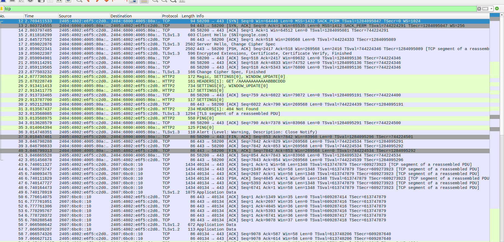
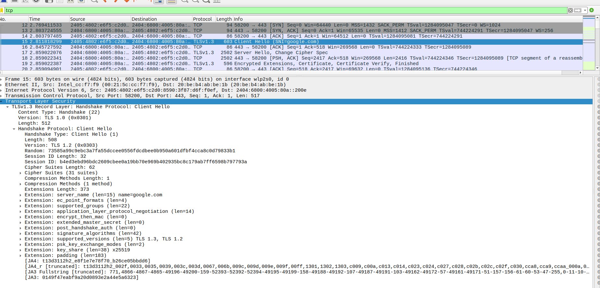
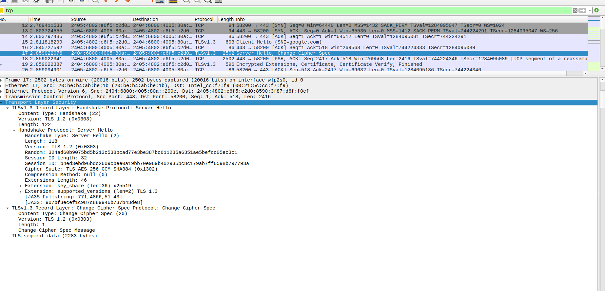
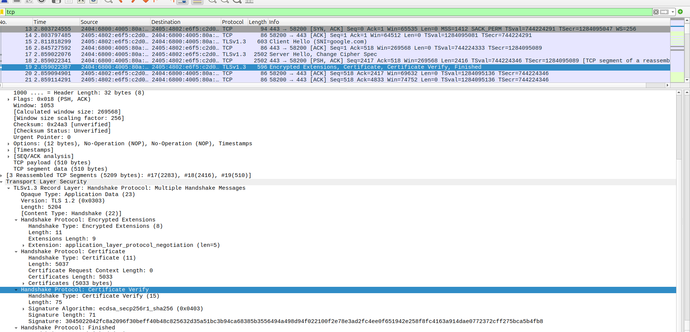

# Wireshark TLS 1.3 Capture Walkthrough

A step-by-step look at a real TLS 1.3 handshake captured with Wireshark.

---

## 1. Full Session Overview



The capture shows the complete flow:
1. **DNS** — resolving the target hostname
2. **TCP** — three-way handshake (SYN / SYN-ACK / ACK)
3. **TLS Handshake** — ClientHello → ServerHello → Certificate → Finished
4. **Application Data** — encrypted payload (not readable without keys)

---

## 2. Client Hello



The client initiates TLS and advertises its capabilities:

| Field | Value |
|-------|-------|
| Version | TLS 1.3 (0x0303) |
| Random | 32 random bytes |
| Cipher Suites | List of supported suites |
| Extensions | SNI, key share, supported groups, signature algorithms, supported versions |

The **SNI (Server Name Indication)** extension tells the server which hostname the client wants — important for servers hosting multiple domains.

---

## 3. Server Hello



The server responds and picks the parameters:

| Field | Value |
|-------|-------|
| Version | TLS 1.3 |
| Random | 32 random bytes |
| Cipher Suite | `TLS_AES_256_GCM_SHA384` |

Immediately followed by **Change Cipher Spec** — the server switches to encrypted mode. From this point, all server messages are encrypted.

---

## 4. Certificate



The server sends its certificate chain for authentication:

- Certificate length and structure visible
- **Signature scheme**: `ecdsa_secp384r1_sha384`
- Contains the server's public key
- Client verifies this against trusted root CAs

---

## Key Takeaway

In TLS 1.3, the handshake completes in **1 round trip (1-RTT)**. Application Data is encrypted immediately after the handshake — Wireshark shows only the size, not the content, unless a `SSLKEYLOGFILE` is provided.

---

## 5. Decrypting Application Data

By default Application Data is unreadable. To decrypt it:

**Step 1** — Set the key log env var before launching your browser or curl:
```bash
export SSLKEYLOGFILE=~/tls-keys.log
```

**Step 2** — Run your traffic (browser, curl, etc.). Session keys are written to the file automatically.

**Step 3** — In Wireshark:
```
Edit → Preferences → Protocols → TLS
```
Set `(Pre)-Master-Secret log filename` to `~/tls-keys.log`.

**Step 4** — Wireshark will now show the decrypted HTTP/2 or HTTP/1.1 payload inside Application Data rows.

> **Note:** TLS 1.3 uses forward secrecy (ECDHE) by default — the RSA private key alone cannot decrypt traffic. `SSLKEYLOGFILE` is the only method that works.
